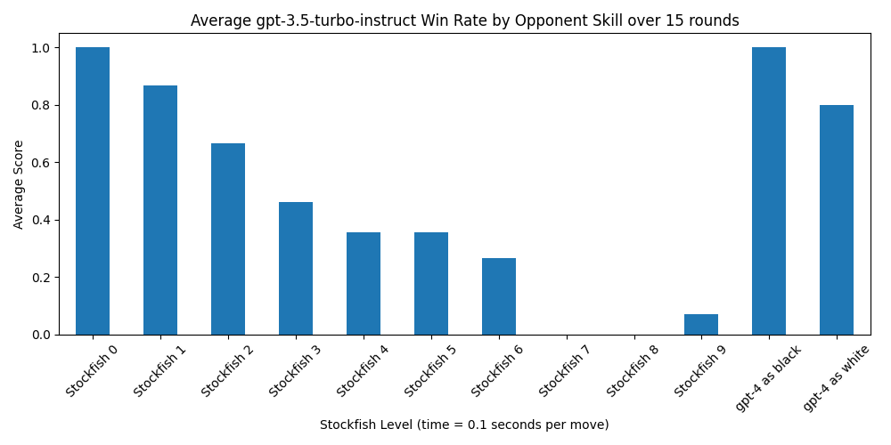

**Overview**

There has recently been some buzz about the ability of GPT-3.5-turbo-instruct's chess playing ability. I wanted to take a more rigourous look and created this repo. With it, you can play two models against each other, whether that's LLM vs Stockfish, LLM vs LLM, or Stockfish vs Stockfish. The primary goal is to test and record the performance of these players against one another in various configurations. Illegal moves, resignations, and game states are all tracked and recorded for later analysis. Per move, a model gets 5 illegal moves before forced resignation of the round.

**Results**

GPT-3.5-turbo instruct does well in 150 games against various Stockfish levels and 30 games against GPT-4. Most of gpt-4's losses were due to illegal moves, so it may be possible to come up with a prompt to have gpt-4 correct illegal moves and improve its score.



gpt-3.5-turbo-instruct's illegal move rate is under 0.1% over 8205 moves (possibly 0%, I had insufficient recording and state validation going on during my run... TODO), and the longest game had 147 moves.

`analysis.ipynb` results:
```
total moves: 8205, total illegal moves: 5 or less
Ratio of Player One's Illegal Moves to Total Moves: 0.0006 or less
Minimum Moves: 15
Maximum Moves: 147
Median Moves: 45.0
Standard Deviation of Moves: 21.90
```

All results were gathered on Stockfish 16 with 0.1 seconds per move on a 2023 M1 Mac. I ran a Stockfish benchmark using `% stockfish bench 1024 16 26 default depth nnue 1>/dev/null 2>stockfish_M1Mac.bench` and stored the output in `logs/stockfish_M1Mac.bench`.

**Setup**

- Install the necessary libraries in `requirements.txt` using pip.
- Copy paste your OpenAI API key in `gpt_inputs/api_key.txt`.
- If you plan on using StockfishPlayer, ensure Stockfish is installed on your system and accessible from your system path. On Mac, this is done with `brew install stockfish`. On Linux, you can use `apt install stockfish`.

**Game Recording**

- record_results(): This function logs the game's outcome, various statistics, and game states into a CSV file.
- Additionally, the entire game state is written to a game.txt file, although it gets overwritten every round.
- There is always a transcript of the most recent GPT API call and response in `gpt_outputs/transcript.txt`.

**How to Use**

- Set the desired players by instantiating them at the bottom of `main.py`.
- As an example, to pit `gpt-3.5-turbo-instruct` against Stockfish level 5 in a match of 15 rounds, do the following before running the program:

```
num_games = 15
player_one = GPTPlayer(model="gpt-3.5-turbo-instruct")
player_two = StockfishPlayer(skill_level=5, play_time=0.1)
play_game(player_one, player_two, num_games)
```

- For analysis and graphing purposes, you can check out the contents of `analysis.ipynb`.

**Other Capabilities**

There is the ability to run other models using OpenRouter or Hugging Face. However, I've found that other models, like Llama2-70b chat won't provide formatted moves, and Llama2-70b base will hallucinate illegal moves. In addition, it seems like gpt-4 consistently loses to gpt-3.5-turbo-instruct, usually due to forced resignation after 5 illegal moves.

In the local_llama branch, there is some working but poorly documented code to evaluate local Llama and NanoGPT models as well.

In the dataset_generation branch, I played a distribution of Stockfish vs Stockfish levels against each other to create a dataset to train a NanoGPT model on chess games, which worked to create a ~1200 ELO chess LLM.

**Stockfish to ELO**

Stockfish provides this estimate of [Stockfish level to ELO](https://github.com/official-stockfish/Stockfish/commit/a08b8d4):

```
   # PLAYER             :  RATING  ERROR  POINTS  PLAYED   (%)
   1 master-skill-19    :  3191.1   40.4   940.0    1707    55
   2 master-skill-18    :  3170.3   39.3  1343.0    2519    53
   3 master-skill-17    :  3141.3   37.8  2282.0    4422    52
   4 master-skill-16    :  3111.2   37.1  2773.0    5423    51
   5 master-skill-15    :  3069.5   37.2  2728.5    5386    51
   6 master-skill-14    :  3024.8   36.1  2702.0    5339    51
   7 master-skill-13    :  2972.9   35.4  2645.5    5263    50
   8 master-skill-12    :  2923.1   35.0  2653.5    5165    51
   9 master-skill-11    :  2855.5   33.6  2524.0    5081    50
  10 master-skill-10    :  2788.3   32.0  2724.5    5511    49
  11 stash-bot-v25.0    :  2744.0   31.5  1952.5    3840    51
  12 master-skill-9     :  2702.8   30.5  2670.0    5018    53
  13 master-skill-8     :  2596.2   28.5  2669.5    4975    54
  14 stash-bot-v21.0    :  2561.2   30.0  1338.0    3366    40
  15 master-skill-7     :  2499.5   28.5  1934.0    4178    46
  16 stash-bot-v20.0    :  2452.6   27.7  1606.5    3378    48
  17 stash-bot-v19.0    :  2425.3   26.7  1787.0    3365    53
  18 master-skill-6     :  2363.2   26.4  2510.5    4379    57
  19 stash-bot-v17.0    :  2280.7   25.4  2209.0    4378    50
  20 master-skill-5     :  2203.7   25.3  2859.5    5422    53
  21 stash-bot-v15.3    :  2200.0   25.4  1757.0    4383    40
  22 stash-bot-v14      :  2145.9   25.5  2890.0    5167    56
  23 stash-bot-v13      :  2042.7   25.8  2263.5    4363    52
  24 stash-bot-v12      :  1963.4   25.8  1769.5    4210    42
  25 master-skill-4     :  1922.9   25.9  2690.0    5399    50
  26 stash-bot-v11      :  1873.0   26.3  2203.5    4335    51
  27 stash-bot-v10      :  1783.8   27.8  2568.5    4301    60
  28 master-skill-3     :  1742.3   27.8  1909.5    4439    43
  29 master-skill-2     :  1608.4   29.4  2064.5    4389    47
  30 stash-bot-v9       :  1582.6   30.2  2130.0    4230    50
  31 master-skill-1     :  1467.6   31.3  2015.5    4244    47
  32 stash-bot-v8       :  1452.8   31.5  1953.5    3780    52
  33 master-skill-0     :  1320.1   32.9   651.5    2083    31
```

It's difficult to make an exact comparison with my results due to differences in hardware and run time, but this can give a ballpark estimate. Stockfish ELO estimates were obtained with 120 seconds of run time, while I used 0.1 seconds. From my testing at lower Stockfish skill levels, 0.01 seconds vs 1 second makes relatively little difference.